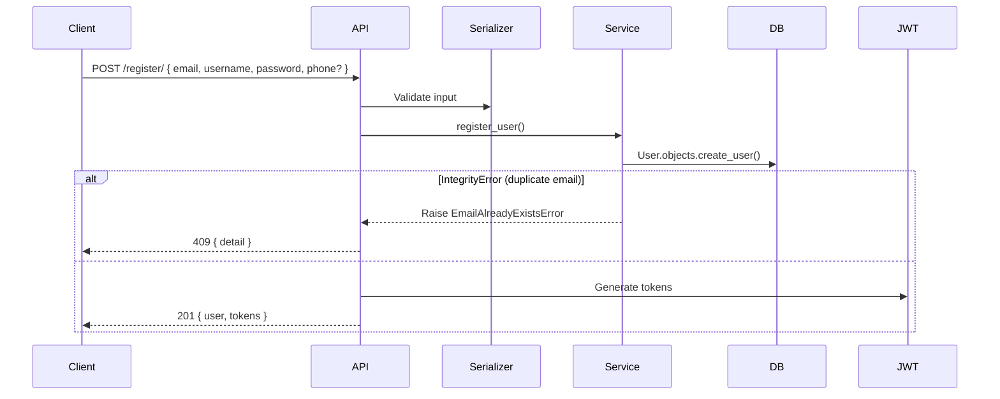
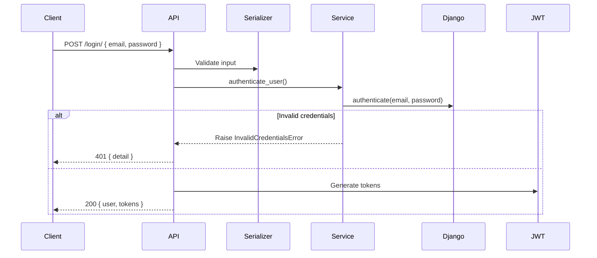

# Auth: Authentication & Token Management

**Version**: 1.0.0
**Status**: Implemented
**Last Updated**: 2026-05-28

---

## 1. Overview

Handles user registration, login, and JWT token management. Users authenticate via email/password and receive JWT access + refresh tokens.

**Scope**:
- Email/password registration
- Email/password login
- JWT access token (60 min) and refresh token (1 day)
- Custom JWT claims (email, is_staff)

---

## 2. Data Model

| Entity | Field | Type | Constraints | Notes |
|--------|-------|------|-------------|-------|
| `User` | `id` | auto | PK | |
| `User` | `email` | EmailField | unique, required, lowercase | Used as USERNAME_FIELD |
| `User` | `username` | CharField(150) | required | Standard Django field |
| `User` | `password` | CharField | write_only | Hashed, Django validators |
| `User` | `phone` | CharField(20) | blank=True | Optional |
| `User` | `profile_picture` | ImageField | blank=True | Uploaded to `avatars/` |
| `User` | `is_staff` | BooleanField | default=False | Admin flag |
| `User` | `created_at` | DateTimeField | auto_now_add | From TimeStampedModel |
| `User` | `updated_at` | DateTimeField | auto_now | From TimeStampedModel |

**Auth**: `email` is `USERNAME_FIELD`, inherits `AbstractUser` + `TimeStampedModel`.

---

## 3. API Contracts

| Method | Path | Auth | Request | Response | Status Codes |
|--------|------|------|---------|----------|-------------|
| POST | `/api/v1/auth/register/` | No | `RegisterInput` | `AuthResponse` | 201, 409, 400 |
| POST | `/api/v1/auth/login/` | No | `LoginInput` | `AuthResponse` | 200, 401, 400 |
| POST | `/api/v1/auth/token/refresh/` | No | `{"refresh": "string"}` | `{"access": "string"}` | 200, 401 |

### Request Schemas

**RegisterInput**
```json
{
  "email": "user@example.com",
  "username": "johndoe",
  "password": "securePass123",
  "phone": "+8801234567890"
}
```

| Field | Type | Required | Notes |
|-------|------|----------|-------|
| email | string (email) | Yes | Lowercased before storage |
| username | string (max 150) | Yes | |
| password | string (min 8) | Yes | Django password validators apply |
| phone | string | No | Optional, max 20 chars |

**LoginInput**
```json
{
  "email": "user@example.com",
  "password": "securePass123"
}
```

| Field | Type | Required |
|-------|------|----------|
| email | string (email) | Yes |
| password | string | Yes |

### Response Schemas

**AuthResponse** (201 Created / 200 OK)
```json
{
  "user": {
    "id": 1,
    "email": "user@example.com",
    "username": "johndoe",
    "phone": "+8801234567890",
    "profile_picture": null,
    "addresses": []
  },
  "tokens": {
    "access": "eyJhbGciOiJIUzI1NiIs...",
    "refresh": "eyJhbGciOiJIUzI1NiIs..."
  }
}
```

**TokenRefreshResponse** (200 OK)
```json
{
  "access": "eyJhbGciOiJIUzI1NiIs..."
}
```

**Error Response** (all errors)
```json
{
  "detail": "Human-readable error message"
}
```

### Token Details

| Property | Value |
|----------|-------|
| Access token lifetime | 60 minutes |
| Refresh token lifetime | 1 day |
| Custom claims | `email`, `is_staff` in payload |

---

## 4. Business Rules

| ID | Rule | Enforcement | Error |
|----|------|-------------|-------|
| BR-001 | Email must be unique | DB unique constraint + IntegrityError catch | `EmailAlreadyExistsError` → 409 |
| BR-002 | Password must pass Django validators | Serializer + model validation | ValidationError → 400 |
| BR-003 | Username must be unique | Django AbstractUser default | IntegrityError → 400 |
| BR-004 | Login requires matching email+password | Django `authenticate()` | `InvalidCredentialsError` → 401 |

---

## 5. Error Handling

| Exception | HTTP Status | Trigger |
|-----------|-------------|---------|
| `EmailAlreadyExistsError` | 409 Conflict | Email already registered |
| `InvalidCredentialsError` | 401 Unauthorized | Wrong email or password |
| ValidationError (DRF) | 400 Bad Request | Invalid field values |

---

## 6. Authorization

| Endpoint | Permission | Notes |
|----------|-----------|-------|
| `POST /register/` | `AllowAny` | Public |
| `POST /login/` | `AllowAny` | Public |
| `POST /token/refresh/` | `AllowAny` | Public |

Default DRF permission is `IsAuthenticated` (applies to all other endpoints).

---

## 7. Sequence Flows

### Registration


### Login


---

## 8. Testing Scenarios

| Scenario | Action | Expected |
|----------|--------|----------|
| Register valid user | POST valid data to /register/ | 201 + tokens |
| Register duplicate email | POST same email twice | 409 Conflict |
| Register short password | POST password < 8 chars | 400 Bad Request |
| Login valid credentials | POST correct email+password | 200 + tokens |
| Login wrong password | POST wrong password | 401 Unauthorized |
| Login non-existent user | POST unknown email | 401 Unauthorized |
| Refresh valid token | POST valid refresh token | 200 + new access |
| Refresh expired token | POST expired refresh token | 401 Unauthorized |

---

## 9. Dependencies

- **Internal**: `TimeStampedModel` from `core`
- **External**: `rest_framework`, `rest_framework_simplejwt`, `drf_spectacular`

---

## 10. Changelog

| Version | Date | Author | Changes |
|---------|------|--------|---------|
| 1.0.0 | 2026-05-28 | — | Initial spec (backfilled from implementation) |
