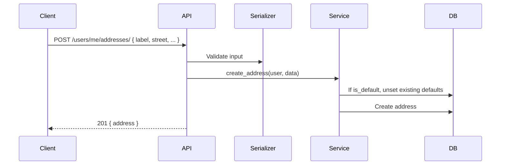
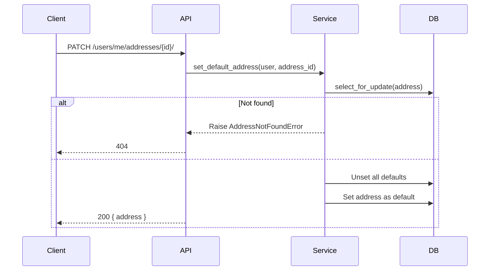
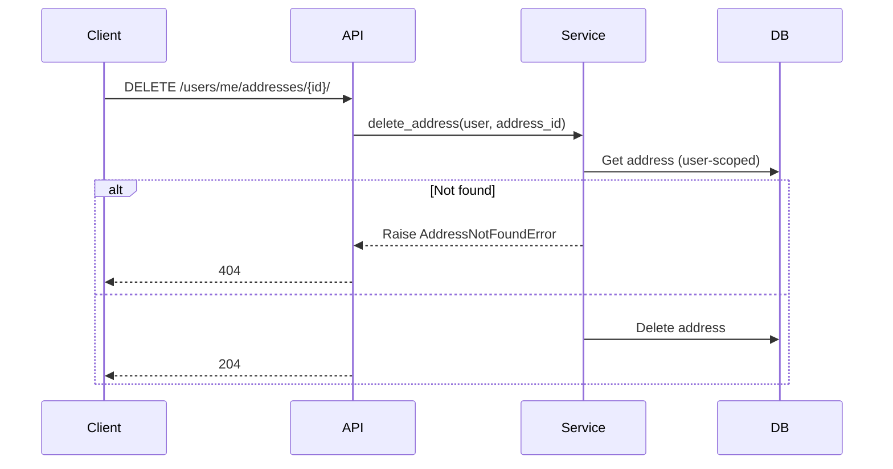

# Users: Profile & Address Management

**Version**: 1.0.0
**Status**: Implemented
**Last Updated**: 2026-05-28

---

## 1. Overview

Manages authenticated user profiles and addresses. Users can view/update their profile and manage multiple delivery addresses.

**Scope**:
- Get own user profile
- Update profile (phone, username)
- List own addresses
- Create address
- Set address as default
- Delete address

---

## 2. Data Model

| Entity | Field | Type | Constraints | Notes |
|--------|-------|------|-------------|-------|
| `Address` | `id` | auto | PK | |
| `Address` | `user` | FK(User) | required, CASCADE | `related_name='addresses'` |
| `Address` | `label` | CharField(50) | required | e.g. "Home", "Office" |
| `Address` | `street` | TextField | required | Full street address |
| `Address` | `city` | CharField(100) | required | |
| `Address` | `country` | CharField(100) | required | |
| `Address` | `postal_code` | CharField(20) | required | |
| `Address` | `is_default` | BooleanField | default=False | Only one per user |
| `Address` | `created_at` | DateTimeField | auto_now_add | |
| `Address` | `updated_at` | DateTimeField | auto_now | |

### Relationships
```
User 1──N Address
```

---

## 3. API Contracts

| Method | Path | Auth | Request | Response | Status Codes |
|--------|------|------|---------|----------|-------------|
| GET | `/api/v1/auth/users/me/` | Yes | — | `UserOutput` | 200, 401 |
| PATCH | `/api/v1/auth/users/me/` | Yes | `ProfileUpdateInput` | `UserOutput` | 200, 401, 400 |
| GET | `/api/v1/auth/users/me/addresses/` | Yes | — | `AddressOutput[]` | 200, 401 |
| POST | `/api/v1/auth/users/me/addresses/` | Yes | `AddressInput` | `AddressOutput` | 201, 401, 400 |
| PATCH | `/api/v1/auth/users/me/addresses/{id}/` | Yes | — | `AddressOutput` | 200, 401, 404 |
| DELETE | `/api/v1/auth/users/me/addresses/{id}/` | Yes | — | — | 204, 401, 404 |

### Request Schemas

**ProfileUpdateInput**
```json
{
  "phone": "+8801234567890",
  "username": "newname"
}
```

| Field | Type | Required | Notes |
|-------|------|----------|-------|
| phone | string | No | Max 20 chars |
| username | string (max 150) | No | |

**AddressInput**
```json
{
  "label": "Home",
  "street": "123 Main St",
  "city": "Dhaka",
  "country": "Bangladesh",
  "postal_code": "1205",
  "is_default": true
}
```

| Field | Type | Required | Default |
|-------|------|----------|---------|
| label | string (max 50) | Yes | — |
| street | string | Yes | — |
| city | string (max 100) | Yes | — |
| country | string (max 100) | Yes | — |
| postal_code | string (max 20) | Yes | — |
| is_default | boolean | No | false |

### Response Schemas

**UserOutput**
```json
{
  "id": 1,
  "email": "user@example.com",
  "username": "johndoe",
  "phone": "+8801234567890",
  "profile_picture": null,
  "addresses": [
    {
      "id": 1,
      "label": "Home",
      "street": "123 Main St",
      "city": "Dhaka",
      "country": "Bangladesh",
      "postal_code": "1205",
      "is_default": true
    }
  ]
}
```

**AddressOutput**
```json
{
  "id": 1,
  "label": "Home",
  "street": "123 Main St",
  "city": "Dhaka",
  "country": "Bangladesh",
  "postal_code": "1205",
  "is_default": true
}
```

---

## 4. Business Rules

| ID | Rule | Enforcement | Error |
|----|------|-------------|-------|
| BR-001 | Addresses are scoped to the authenticated user | View filters by `request.user` | 404 if another user's address ID |
| BR-002 | Only one default address per user | `set_default_address` clears others via `update(is_default=False)` | — |
| BR-003 | Creating a new default address clears existing defaults | Atomic transaction in `create_address` | — |
| BR-004 | Deleting an address permanently removes it | `address.delete()` | — |

---

## 5. Error Handling

| Exception | HTTP Status | Trigger |
|-----------|-------------|---------|
| `AddressNotFoundError` | 404 Not Found | Address ID doesn't belong to user |
| ValidationError | 400 Bad Request | Missing or invalid field values |

---

## 6. Authorization

| Endpoint | Permission | Notes |
|----------|-----------|-------|
| All | `IsAuthenticated` | Requires valid JWT access token |

---

## 7. Sequence Flows

### Create Address


### Set Default Address


### Delete Address


---

## 8. Testing Scenarios

| Scenario | Action | Expected |
|----------|--------|----------|
| Get own profile | GET /users/me/ with valid token | 200 + user data |
| Get profile without auth | GET /users/me/ no token | 401 |
| Update phone | PATCH /users/me/ { phone } | 200 + updated phone |
| Update username | PATCH /users/me/ { username } | 200 + updated username |
| List addresses | GET /users/me/addresses/ | 200 + address array |
| Create address | POST valid address data | 201 |
| Create default address | POST with is_default=true | Existing defaults cleared |
| Set default address | PATCH existing address | 200 + is_default=true |
| Delete own address | DELETE existing address | 204 |
| Delete non-existent address | DELETE wrong ID | 404 |
| Delete another user's address | DELETE address owned by other | 404 |

---

## 9. Dependencies

- **Internal**: Auth spec (JWT required), `TimeStampedModel`

---

## 10. Changelog

| Version | Date | Author | Changes |
|---------|------|--------|---------|
| 1.0.0 | 2026-05-28 | — | Initial spec (backfilled from implementation) |
