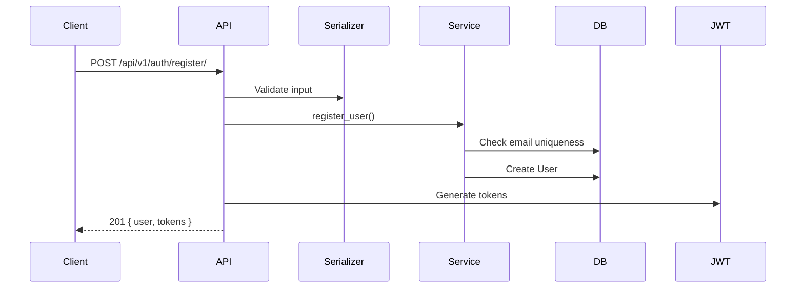
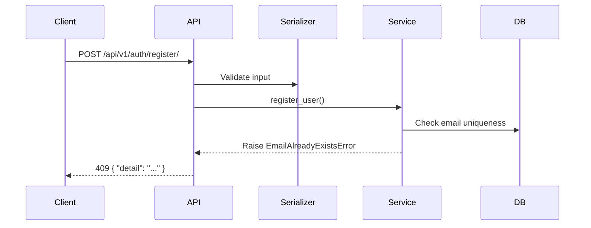

# {Domain}: {Feature Name}

**Version**: 1.0.0
**Status**: Draft | Approved | Implemented
**Last Updated**: YYYY-MM-DD

---

## 1. Overview

Brief description of what this feature does, why it exists, and how it fits into the broader system.

**Scope**:
- What is in scope
- What is explicitly out of scope

---

## 2. Data Model

| Entity | Field | Type | Constraints | Notes |
|--------|-------|------|-------------|-------|
| `User` | `email` | `EmailField` | unique, required, lowercase | Used as USERNAME_FIELD |
| `User` | `phone` | `CharField(20)` | blank=True | Optional |
| `Address` | `label` | `CharField(50)` | required | e.g. "Home", "Office" |

### Relationships

```
User 1──N Address
```

### State Machine (if applicable)

```
State A ──→ State B ──→ State C
    │                      │
    └──→ State D ←─────────┘
```

---

## 3. API Contracts

| Method | Path | Auth | Request | Response | Status Codes |
|--------|------|------|---------|----------|-------------|
| POST | `/api/v1/auth/register/` | No | `RegisterInput` | `AuthResponse` | 201, 409 |
| POST | `/api/v1/auth/login/` | No | `LoginInput` | `AuthResponse` | 200, 401 |
| GET | `/api/v1/auth/users/me/` | Yes | — | `UserOutput` | 200 |

### Request Schemas

**RegisterInput**
```json
{
  "email": "user@example.com",
  "username": "johndoe",
  "password": "securePass123",
  "phone": "+8801234567890"
}
```

| Field | Type | Required | Notes |
|-------|------|----------|-------|
| email | string (email) | Yes | Lowercased before storage |
| username | string (max 150) | Yes | |
| password | string (min 8) | Yes | Validated against Django password validators |
| phone | string | No | |

### Response Schemas

**AuthResponse** (201 Created / 200 OK)
```json
{
  "user": {
    "id": 1,
    "email": "user@example.com",
    "username": "johndoe",
    "phone": "+8801234567890",
    "profile_picture": null,
    "addresses": []
  },
  "tokens": {
    "access": "eyJ...",
    "refresh": "eyJ..."
  }
}
```

**Error Response** (all errors)
```json
{
  "detail": "Human-readable error message"
}
```

---

## 4. Business Rules

| ID | Rule | Enforcement | Error |
|----|------|-------------|-------|
| BR-001 | Email must be unique | Service layer check before create | `EmailAlreadyExistsError` → 409 |
| BR-002 | Password must pass Django validators | Serializer validation | ValidationError → 422 |
| BR-003 | Only one default address per user | Set existing defaults to False before saving | — |

---

## 5. Error Handling

| Exception | HTTP Status | Trigger |
|-----------|-------------|---------|
| `EmailAlreadyExistsError` | 409 Conflict | Duplicate email on registration |
| `InvalidCredentialsError` | 401 Unauthorized | Wrong email/password on login |
| `AddressNotFoundError` | 404 Not Found | Address does not belong to user |

---

## 6. Authorization

| Endpoint | Required Permission | Notes |
|----------|-------------------|-------|
| `POST /api/v1/auth/register/` | `AllowAny` | |
| `POST /api/v1/auth/login/` | `AllowAny` | |
| `GET /api/v1/auth/users/me/` | `IsAuthenticated` | Returns profile of token owner |
| `PATCH /api/v1/auth/users/me/` | `IsAuthenticated` | Only updates allowed fields |

**RBAC Roles** (if applicable):
| Role | Privileges |
|------|-----------|
| Buyer | View products, manage cart, place orders |
| Seller | Manage own products and inventory |
| Admin | Full access, user management |

---

## 7. Sequence Flows

### Registration (Happy Path)


### Registration (Duplicate Email)


---

## 8. Testing Scenarios

| Scenario | Input | Expected |
|----------|-------|----------|
| Register with valid data | `{ email, username, password }` | 201 + tokens |
| Register with existing email | `{ email: already_used }` | 409 Conflict |
| Register with short password | `{ password: "123" }` | 422 Validation Error |
| Login with correct credentials | `{ email, password }` | 200 + tokens |
| Login with wrong password | `{ email, password: "wrong" }` | 401 Unauthorized |
| Get profile without token | — | 401 Unauthorized |
| Get profile with valid token | — | 200 + user data |

---

## 9. Dependencies

- **Internal**: Core app (`TimeStampedModel`), JWT library
- **External**: None

---

## 10. Changelog

| Version | Date | Author | Changes |
|---------|------|--------|---------|
| 1.0.0 | 2026-05-27 | — | Initial spec |
